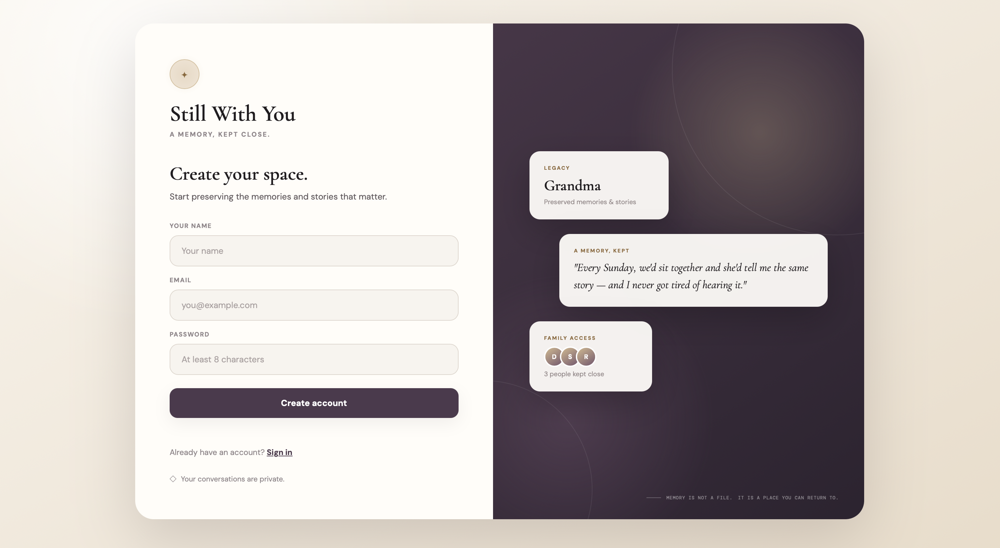
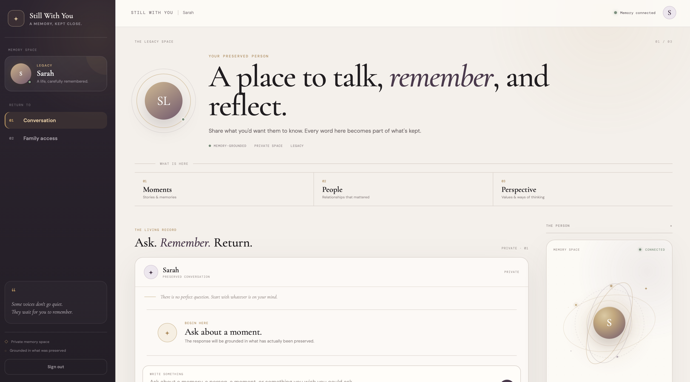
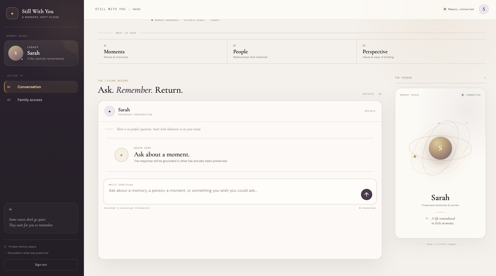
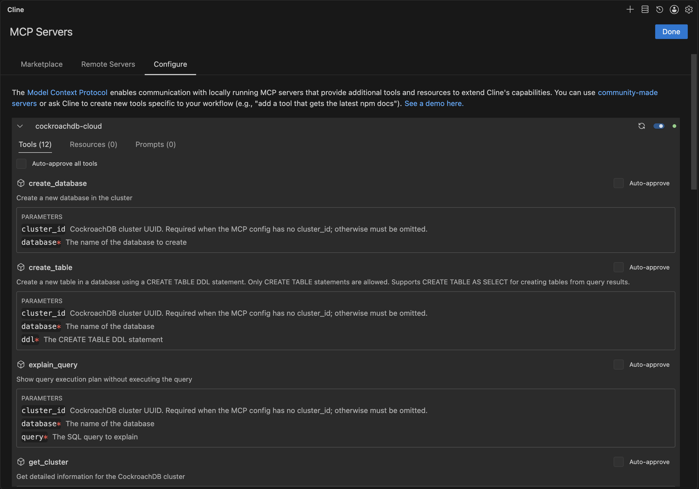
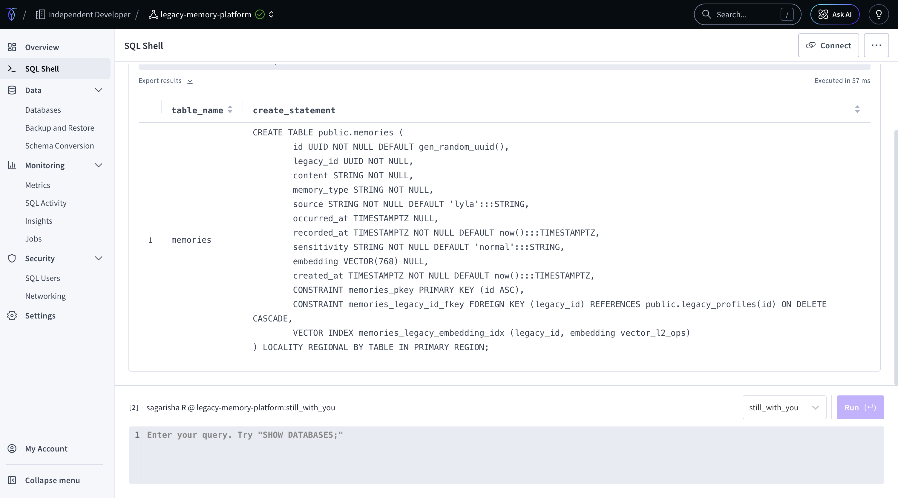

<div align="center">

# Still With You

### AI-Powered Digital Legacy & Memory Preservation Platform


**License: MIT** · Built for the **CockroachDB × AWS Hackathon : Build with Agentic Memory**

</div>

---

> **Still With You is an AI-powered digital legacy platform that allows people to continue meaningful conversations with someone they have lost by creating an AI experience grounded in that person's preserved memories, stories, values, experiences, and way of speaking.**
 
>**Instead of simply storing memories as photos, documents, or notes, Still With You turns those memories into an interactive conversational experience.
You can ask questions.
You can talk about something that happened.
You can ask for advice.
You can revisit a story.
You can simply say, "I miss you."
The goal is not to replace the person.
It is to create a way to continue the connection through what they left behind.**

## Submission Link

| | |
|---|---|
| 🌐 Live demo | **[staging.d12jw6rtkbuyc8.amplifyapp.com](https://staging.d12jw6rtkbuyc8.amplifyapp.com)** |

---

## ❤️ The Problem
Losing someone we love creates a unique kind of absence.
There are questions we never got to ask.
Advice we wish we could hear one more time.
Stories we wish we could revisit.
Moments when we instinctively want to call them.
And sometimes, the hardest part isn't forgetting their face or their voice it is losing the ability to have those small, everyday conversations.
Traditional digital legacy solutions can preserve:
Photos,
Videos,
Documents,
Messages,
Audio recordings,
Written memories.
But these are still primarily things we look at.
They don't answer:
"What if I could still talk to them?"
That is the problem Still With You explores.

## 💡 The Solution

Still With You transforms preserved memories into an interactive conversational Legacy.
Family members and people who knew someone can contribute memories, stories, experiences, advice, values, and personal details about them.
The system builds a persistent memory layer from these contributions.
Later, an authorized person can interact with that Legacy conversationally.

```
Human memories → Persistent memory (CockroachDB) → Semantic retrieval → AI conversation → Grounded response
```

## Features

- **Legacy Space** : a dedicated, private space for one preserved person
- **Memory preservation** : stories, values, advice, and everyday moments stored as persistent data, not chat history
- **Semantic retrieval** : a question doesn't need the exact words a memory used; CockroachDB's vector search finds what's *meant*, not just what's typed
- **Family access** : the owner invites people by email + relationship; access is granted automatically the moment that person signs up
- **Relationship-aware** : the interface reflects each visitor's actual relationship to the legacy (daughter, son, spouse, etc.)
- **Owner vs. member separation** : the owner privately contributes memories; members converse with the legacy two distinct modes on one shared memory layer

---

## CockroachDB Tools Used 

| Tool | How it's used |
|---|---|
| **Distributed Vector Indexing** | Runtime  every memory is stored as a `VECTOR(768)` embedding with a real vector index. When someone asks a question, the app searches this index for semantically related memories before generating a response. This is the actual retrieval mechanism, not a demo feature. |
| **Cloud Managed MCP Server** | Development time  we connected Cline (an AI dev agent in VS Code) to our live cluster via `https://cockroachlabs.cloud/mcp`, authenticated by OAuth, read-only. Used to inspect the live schema, confirm the vector index was configured correctly, and verify memory data was actually persisting as the app ran. |

**Runtime retrieval flow:**
```
User question → embedding → CockroachDB vector search → relevant memories → AI response
```

**Development-time MCP flow:**
```
Cline (AI agent) → MCP → CockroachDB Cloud cluster → schema / data verification
```

---

## AWS Services Used

| Service | How it's used |
|---|---|
| **AWS Lambda** | Runs the entire backend  auth, memory capture, chat, family access as a serverless function, called by the frontend via a public Function URL. |
| **AWS Amplify** | Hosts the public frontend at the live demo link above. |

---

## Architecture

```
        USER
          │
          ▼
   AWS Amplify (Frontend)
          │
          ▼
    AWS Lambda (Backend)
          │
          ▼
    ┌──────────────────────────────┐
    │  CockroachDB                 │◄──────► Groq (LLM reasoning)
    │  Cloud                       │
    │                              │
    │  users                       │
    │  legacies                    │
    │  memories                    │  ← VECTOR(768) + vector index
    │  access/invites              │
    │  conversations               │
    └──────────────────────────────-
```

---

## Tech Stack

| Layer | Technology |
|---|---|
| Frontend | HTML / CSS / JavaScript (no framework) |
| Backend | Node.js, AWS Lambda |
| Database | CockroachDB Cloud (relational + vector) |
| LLM | Groq (`openai/gpt-oss-120b`) for responses, Gemini for embeddings |
| Auth | bcrypt password hashing |
| Hosting | AWS Amplify |

---

## Screenshots

**Still With You, live** : The deployed application



**Main Dashboard** 




**CockroachDB Managed MCP Server** : Cline connected to the live cluster


**CockroachDB Vector Memory** : The vector column and index powering retrieval


---

## Testing Flow

1. Open the [live demo](https://staging.d12jw6rtkbuyc8.amplifyapp.com)
2. Create an account,this becomes your own Legacy
3. Share a couple of memories about yourself in the chat box
4. Sign out, sign up and sign back in (both sign up and sign in needed), ask something related to what you shared, and see it retrieved and reflected in the response
5. The point of the test: that memory is **persistent data in CockroachDB**, not something held only in the browser session

---

## Running Locally

```bash
git clone https://github.com/SagarishaR/still-with-you.git
cd still-with-you
npm install
```

Create `.env.local`:
```
GROQ_API_KEY=
GEMINI_API_KEY=
DATABASE_URL=
AUTH_SECRET=
```

```bash
node --env-file=.env.local backend/server.mjs      # backend
python3 -m http.server 5500 --directory frontend    # frontend, separate terminal
```

Open `http://localhost:5500`.

---

## Repository Structure

```
still-with-you/
├── backend/          # local dev server
├── lambda/           # AWS Lambda entry point
├── src/               # router, auth, memory, agent, safety logic
├── frontend/            # index.html, style.css, app.js
├── screenshots/           # README images
├── LICENSE
└── README.md
```

---

<div align="center">

**The database remembers. The AI communicates.**

Built for the CockroachDB × AWS Hackathon : Build with Agentic Memory


